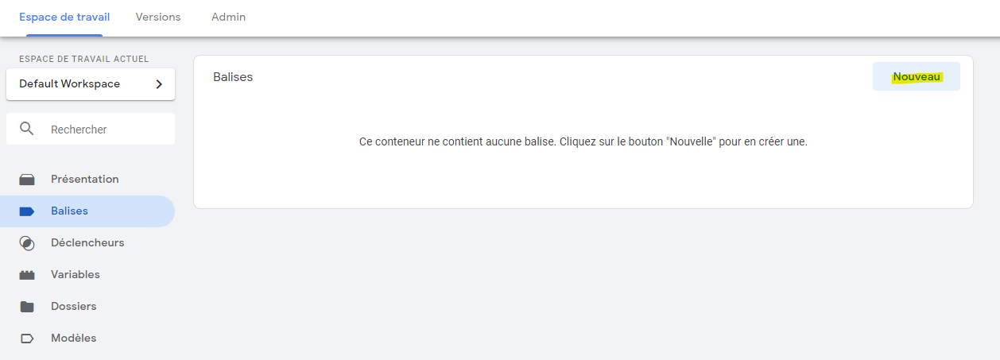
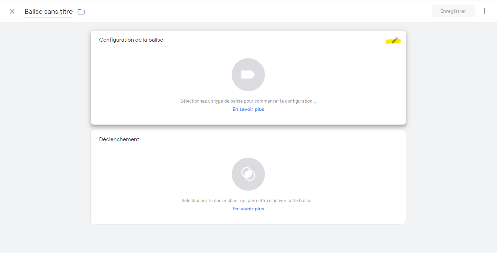
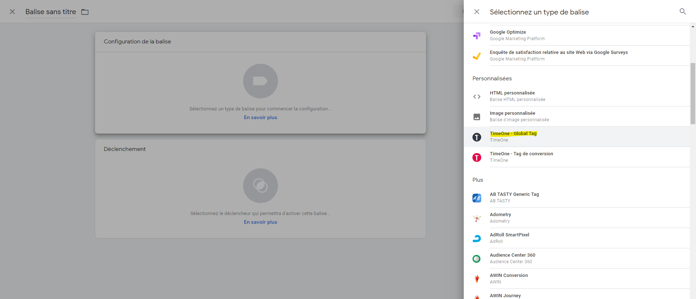
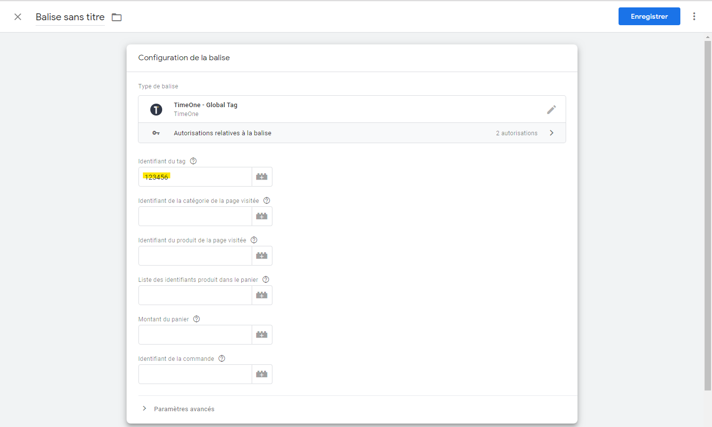
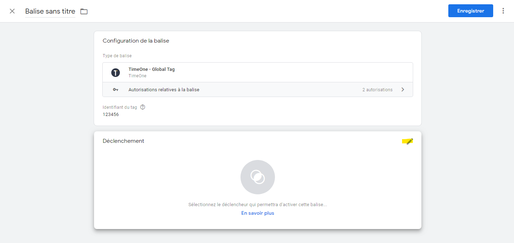
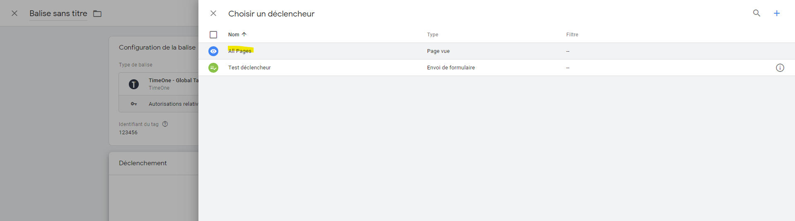
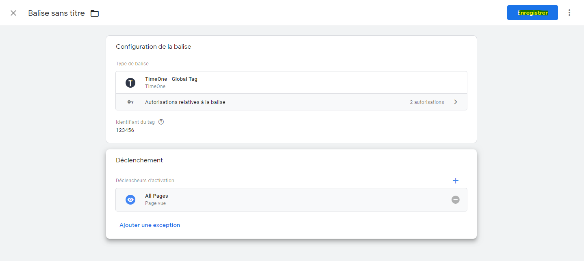

# Installer le Global Tag TimeOne avec Google Tag Manager

Cette documentation a pour but de vous indiquer les étapes pour l'utilisation du Global tag dans l'outil Google Tag Manager (GTM)

## Créez une nouvelle balise

### Espace de Travail > Balises > Nouveau

### Configuration de la balise

Choisir : **TimeOne - Global Tag**

Saisir au minimum la valeur **Identifiant du tag**

### Déclenchement

Choisir : **All Pages**

**Enregistrer**

## Détail des variables

| Variable | Obligatoire | Description |
|---|---|---|
| Identifiant du tag | OUI | Ce paramètre est obligatoire. Il vous est communiqué par l'équipe TimeOne. |
| Identifiant de la catégorie de la page visitée | NON | Indiquez ici votre propre identifiant faisant référence à la catégorie/thématique de la page visitée. |
| Identifiant du produit de la page visitée | NON | Indiquez ici votre propre identifiant faisant référence au produit de la page visitée. |
| Liste des identifiants produit dans le panier | NON | Indiquez ici la liste de vos identifiants de produits contenu dans le panier de l'internaute séparés par des points-virgules. |
| Montant du panier | NON | Indiquez ici le montant total du panier sans inclure les frais de port. |
| Identifiant de la commande | NON | Indiquez ici votre propre identifiant faisant référence à la commande de l'internaute. |
| Identifiant Cross-Device | NON | Indiquez ici votre propre identifiant faisant référence à l'email du client encodé en SHA256. |
